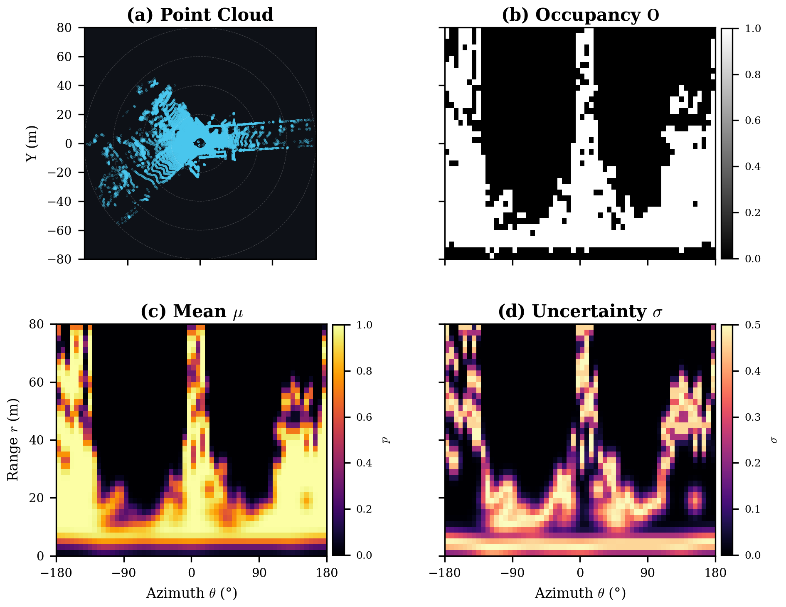

# PROBE: Probabilistic Occupancy BEV Encoding

**Official Python Implementation of PROBE**

[](https://ieeexplore.ieee.org/document/11560908)
[](https://arxiv.org/abs/2603.05965)
[](https://sites.google.com/view/probe-pr)

> **PROBE: Probabilistic Occupancy BEV Encoding with Analytical Translation Robustness for 3D Place Recognition**  
> *Jinseop Lee, Byoungho Lee, Gichul Yoo*  
> **IEEE Robotics and Automation Letters (RA-L), 2026**  
> DOI: [10.1109/LRA.2026.3703245](https://doi.org/10.1109/LRA.2026.3703245)

## 📌 Introduction
**PROBE** is a lightweight, learning-free probabilistic descriptor for LiDAR place recognition. It models each Bird's-Eye-View (BEV) cell's occupancy as a Bernoulli random variable.

By analytically marginalizing over continuous Cartesian translations via the polar Jacobian, PROBE replaces standard heuristic spatial sampling with a closed-form probabilistic model. This yields a single deterministic descriptor with a per-cell distance-adaptive angular uncertainty $\sigma_\theta$. The framework is computationally efficient ($O(R \times S)$ time) and generalizes to unseen, heterogeneous sensor platforms via a single, physically-motivated parameter ($\sigma_t$).

<p align="center">
  
</p>

## 🚀 Key Features
1. **Analytical Marginalization via Polar Jacobian**: Computes continuous translation marginalization directly in the polar distribution domain instead of augmenting views.
2. **Robust Bernoulli-KL Jaccard Scoring ($\mathcal{J}_{KL}$)**: Replaces standard binary Jaccard matching with a shrinkage mechanism that downweights viewpoint-sensitive boundary cells according to their local uncertainty $\sigma$.
3. **Sensor Generalization without Tuning**: We use the translation uncertainty parameter $\sigma_t = 2.0$ m. Derived from the physical translation model, this single parameter applies unchanged across diverse sensors (Ouster OS2-128, Velodyne HDL-64 / HDL-32 / VLP-16) and platforms without per-dataset hyperparameter tuning.

## 🔬 Method Overview

The full pipeline (mirrored in [`probe/probe.py`](probe/probe.py), with paper cross-references) proceeds in six steps:

1. **BEV polar grid construction** — max-height encoding into an $R \times S$ grid (Sec. III-A).
2. **Jacobian-derived adaptive blur** — marginalize continuous translations into per-cell Bernoulli occupancy $(\mu, \sigma)$ (Sec. III-B):
   - Angular blur $\sigma_\theta = \sigma_t / (r \cdot \Delta\theta)$, distance-adaptive (Eq. 5)
   - Radial blur $\sigma_r = \sigma_t / \Delta r$, uniform (Eq. 6)
3. **Ring-mean retrieval key** — rotation-invariant key $\mathbf{k} = [\bar{\mathbf{G}} \,\|\, \bar{\boldsymbol{\mu}}]$ for KD-tree pre-filtering (Sec. III-C, Eq. 9).
4. **FFT rotation alignment** — height cross-correlation yields the heading $\delta^*$ (Sec. III-D.1) and cosine similarity $\mathcal{C}$ (Sec. III-D.3).
5. **Bernoulli-KL Jaccard** — shrinkage-regularized symmetric KL over the soft union gives $\mathcal{J}_{KL}$ (Sec. III-D.2).
6. **Evidence fusion** — the PROBE similarity is $S = \mathcal{J}_{KL} \cdot \mathcal{C}, \quad d = 1 - S$ (Eq. 16).

## 🎬 Demo

Online place recognition with PROBE — query scans matched against a prior map.

<table>
  <tr>
    <td align="center" width="50%">
      <br>
      <em>Single-session</em>
    </td>
    <td align="center" width="50%">
      <br>
      <em>Multi-session</em>
    </td>
  </tr>
</table>

## 🛠️ Installation

Requirements:
- Python 3.8+
- `numpy`
- `scipy`

```bash
pip install -r requirements.txt
```

Or install the package (recommended, enables the `from probe import ...` import anywhere):

```bash
pip install -e .
```

## 🧩 Usage Example

The descriptor generation is fully isolated inside `PROBENode` within [`probe/probe.py`](probe/probe.py). A runnable version of the snippet below is available at [`examples/demo.py`](examples/demo.py). For the full place-recognition pipeline (KD-tree pre-filter over the retrieval keys, followed by full-score re-ranking, as in the paper), see [`examples/retrieval_demo.py`](examples/retrieval_demo.py).

```python
import numpy as np
from probe import PROBENode, compute_score

# 1. Load an N x 3 (or N x 4) point cloud frame
#    (Example dummy point cloud data representing two sequential frames)
pc_map = np.random.rand(100000, 3) * 50.0
pc_query = pc_map + np.array([0.5, 0.2, 0.0])  # slight translation

# 2. Extract PROBE Descriptors
#    (Generates Expected Occupancy Probability mu, Uncertainty sigma, and Height Grid)
#    sigma_t sets the translation uncertainty threshold (Default: 2.0m)
node_m = PROBENode(pc_map, sigma_t=2.0)
node_q = PROBENode(pc_query, sigma_t=2.0)

# 3. Compute Similarity Distance for Place Recognition (0 = Exact Match, 1 = Max Distance)
distance = compute_score(node_m, node_q)

print(f"PROBE Distance: {distance:.4f}")
```

## 📂 Code Structure

```text
PROBE-descriptor/
├── probe/
│   ├── __init__.py     # Public API (PROBENode, compute_score)
│   └── probe.py        # Core PROBENode class and scoring algorithms
├── examples/
│   ├── demo.py             # Minimal pairwise scoring example
│   └── retrieval_demo.py   # Full retrieval: KD-tree pre-filter + re-ranking
├── assets/             # Hero figure and demo GIFs
├── pyproject.toml
├── requirements.txt
├── LICENSE
└── README.md
```

## 📝 Citation

If you use PROBE in your research, please cite our paper:

```bibtex
@article{lee2026probe,
  title={PROBE: Probabilistic Occupancy BEV Encoding with Analytical Translation Robustness for 3D Place Recognition},
  author={Lee, Jinseop and Lee, Byoungho and Yoo, Gichul},
  journal={IEEE Robotics and Automation Letters},
  year={2026},
  doi={10.1109/LRA.2026.3703245}
}
```

## 📑 License

Released under the [MIT License](LICENSE). © 2026 Jinseop Lee.
